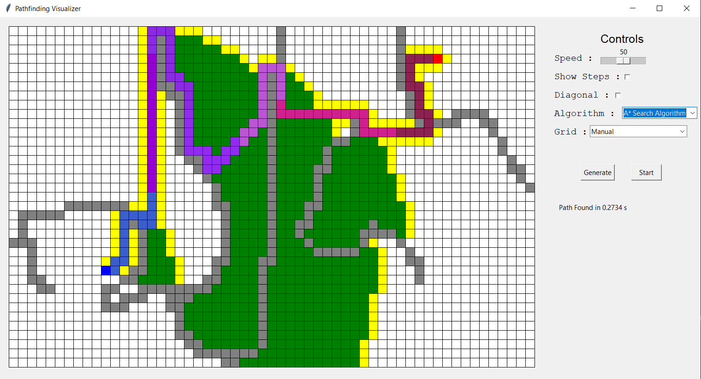
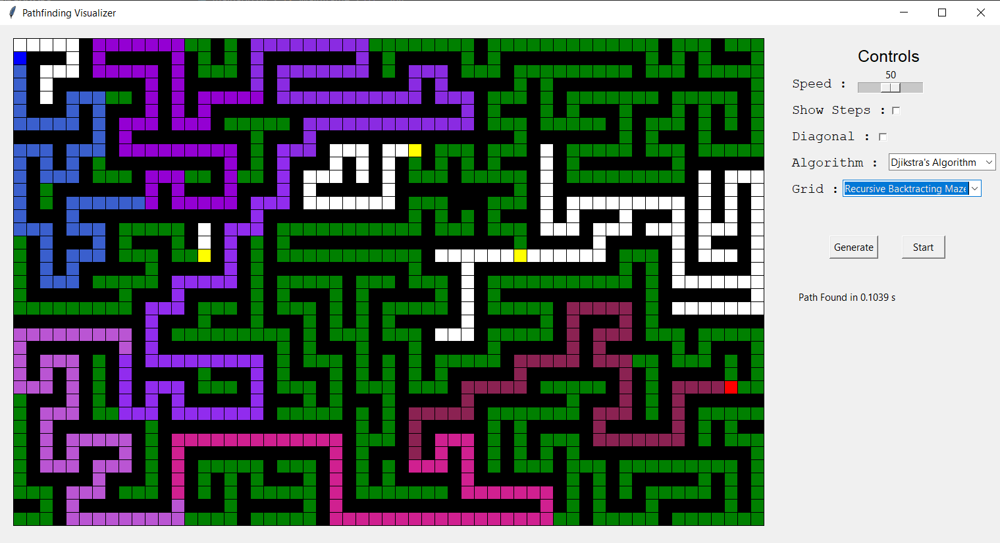

# Pathfinding-Visualizer
A desktop application to showcase the visualization of various pathfinding algorithms with a control panel to modify the finer aspects.
## Description
This is a simple python project to implement the various pathfinding algorithms as well as different maze generation algorithms and to visulaize them with respect to dynamic user inputs to visualize how they work internally. A control panel is also implemented in order to change the features of the algorithms to visualize it in differnt manners and compare the results easily.
## Controls
Set Source  Double Left-click
Set Destination  Double Right-click
Set Walls Left-click
Remove Walls Right-click
## Images
### Manual maze creation with Djikstra's Algorithm

### Kruskal's alagorithm maze creation with A* Star Search Algorithm

## Finer Details
- Both the algorithms i.e Djikstra's and A Star Search support pathfinding in a diagonal manner.
- The speed of the visualization can be specified by the user according to their preferences. The final output can also be obtained directly.
- The maze can be generated using recursive backtracking or Krushkal's algorithm. There is also an option for the user to create a freehand maze manually.
## Future Improvements
I would like to add some sort of zoom functionality in order increae the overall user experience.
I would like to implement more advanced algorithms for pathfinding and maze generation.
## Tools used
- Python 3.8
- Tkinter
